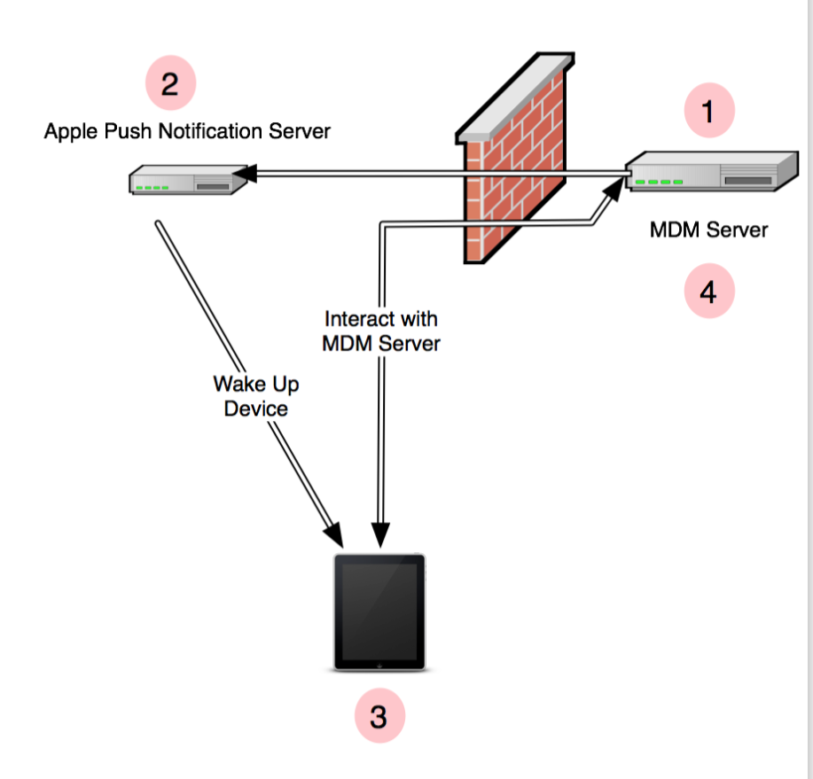
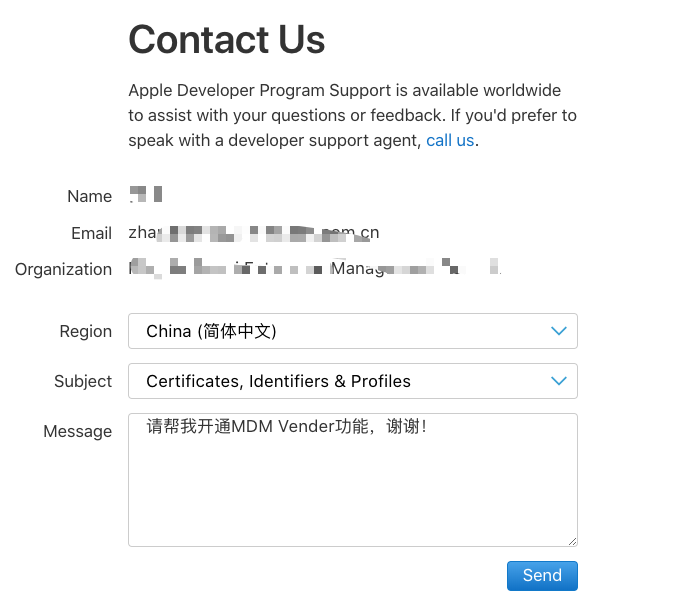
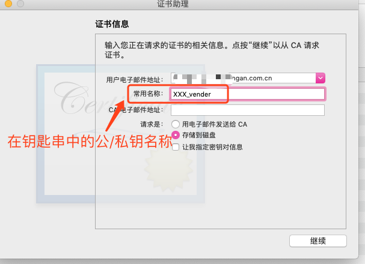
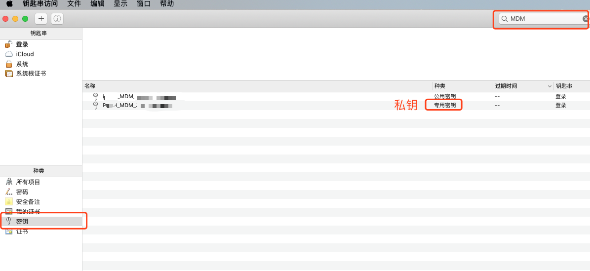
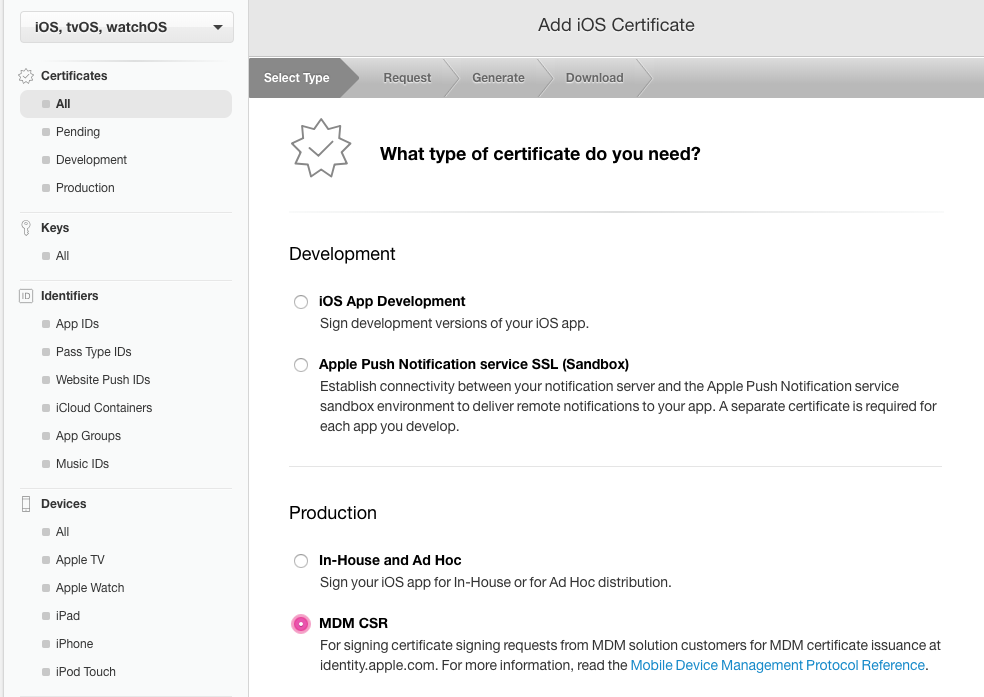
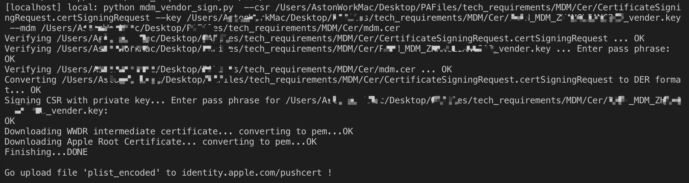

# iOS_MDM_Guide iOS搭建MDM服务器流程
Guide to build MDM Service.

[TOC]

## 基本理念
英文好而且感兴趣的童鞋可以看下本仓库根目录的`BH_US_11_Schuetz_InsideAppleMDM_WP`
摘抄书本主要内容：
>This paper describes how Apple’s MDM system works.
It details the method by which an MDM server initiates a connection to a managed device, how the device enrolls with the server, and the various commands available to the system. Full parameters are provided for each command, as well as details for specialized responses from the device. Finally, source code is provided for a very simple MDM server, that will permit basic experimentation with the MDM protocol using actual iOS devices.

大概翻译：
>本文主要分析MDM的工作机制，以及详细介绍以下功能的实现：
>1. MDM Server如何初始化一个和被管理设备的连接。
>2. 设备如何注册到服务器。
>3. 可用的一些指令及参数。
>4. 简单的MDM Server实现。

MDM 简历链接书中截图：


>1. MDM Server发送查询设备状态指令给APNs.
>2. APNs检查如果设备空闲就发送唤醒指令到设备。
>3. 设备收到唤醒指令，根据配置中的url去连接MDM Server。
>4. 连接建立之后，MDM Server和被管理设备之间即可交换指令。

## 基本条件

## 一、证书及上传文件准备。

### 1. 申请成为MDM Vendor
没有专用于开通功能的网页，需要发送消息给`苹果开发者支持中心`。
链接地址：
[苹果开发者支持中心](https://developer.apple.com/contact/submit/)

**注意**：一定要用Team Agent权限登陆账号申请，Admin权限是会被Apple拒绝的，而且白等半天。

内容就随便写写了：


提交之后会受到邮件提醒，苹果会在1~2个工作日给予答复。

下午3点发出申请，第二天早上9点半得到回复，速度还OK。
答复如下：
****
根据您的需求，已为您启用您账号的MDM Vendor.
****
完成之后可以进行下一步。

### 2. 本地操作
#### i. 创建csr
在钥匙串点击左上角菜单

`钥匙串访问`->`证书助理`->`从证书颁发机构请求证书`

填写信息：
记住常用名称，我填的是'公司简称_MDM_vendor'，查询公私钥会用到

保存到MDM/Cer文件夹。

### ii. 导出.p12
还是在钥匙串中，点击密钥，输入`创建证书申请`中填写常用名称关键字查找，其中，专用密钥就是私钥。

右键，导出，保存为xx_vender.p12，填写.p12使用密码[记住]
现在文件夹下面有2个文件：
> CertificateSigningRequest.certSigningRequest

> xx_vender.p12

>为简化步骤，我们使用 mdm_vendor_sign.py 对 customer 的 csr 进行签名，因此需要将私钥导出为 pem 格式（.key文件）
``` command line
openssl pkcs12 -in xx_vender.p12 -nocerts -out xx_vender.key
```
执行过程中会让输入3次密码：
* 第一次：.p12的使用密码。
* 第二次：创建.key的使用密码。
* 第三次：确认.key的使用密码[*记住*]。

通过之后，文件夹下面会多出一个文件:
> xx_vender.key

### 3. 制作证书
登陆[苹果开发者中心](https://developer.apple.com/account/ios/certificate/)

在Certificate栏目下，点击[+], 添加证书：
苹果开通MDM Vendor功能之后就可以看到这一项了：


选择步骤2.ii 创建的CSR，生成并下载mdm.cer保存，尽量跟上一步的文件放在一起。

### 4. 生成plist_encoded文件。
接下来还有步骤蛮多的生成MDM_Customer的证书及从apple CA验证，和生成plist_encoded文件的工作，幸运的是，有大佬已经把步骤用python脚本实现了，[原文GitHub链接](https://github.com/grinich/mdmvendorsign)。我已经把代码整合进该仓库，使用fabric简化了一点点使用方式, 没有接触过python的iOS也可以几乎无碍搞定，mac本机也有python2.7环境，需要安装一下pip和virtualenv。 pip相当于iOS的pod，包管理工具。virtualenv可以认为是语言版本管理+podfile，完成类似指定该项目使用swift4.0或者swift3.0，及管理该项目依赖包的工具。
#### i. Mac 安装环境依赖:
```
easy_install pip
sudo pip install virtualenv
```

#### ii. 然后clone本仓库所有文件:
```
git clone https://github.com/AstonZ/iOS_MDM_Guide.git
```

#### iii. 进入代码仓库文件夹，在虚拟环境中安装依赖：
```
cd MDM_Server/
创建虚拟环境
virtualenv --python=/usr/bin/python2.7 venv
激活虚拟环境
source venv/bin/activate
安装依赖
pip install -r requirements.txt
```

#### iv. 修改文件配置
编辑fabfile文件
```
cer_dir = '步骤2 生成的xx.csr、xx.key、mdm.cer等文件所在目录'

user_submitted_CSR = os.path.join(cer_dir, 'csr文件名')
mdm_vendor_private_key = os.path.join(cer_dir, 'key文件名')
mdm_certificate_from_apple = os.path.join(cer_dir, 'mdm.cer')
```

#### v. 执行命令
```
fab generate_plist_encoded
```

可以看到控制台输出:

期间需要输入两次密码，即上一步骤设置的csr的密码和key的密码。

执行完成，该项目目录会出现plist_encoded文件，这个就是我们要上传给apple的最终文件。


## 二、创建APNs
登陆[Apple Push Certificates Portal](https://identity.apple.com/pushcert/)
点击 `Create a Certificate`

下载保存为：XXX_MDM_APNs
双击打开钥匙串，看看到该证书名为“APSP:xxxx-xxxx”，如下图所示

钥匙传中打开证书，查看详细信息：
记录以下2项：
com.apple.xxxx
常用名称：xxxx

## 三、生成mobileconfig文件
介绍:
使用工具：APP Configurator 2
[APP Store下载链接](https://itunes.apple.com/cn/app/apple-configurator-2/id1037126344?mt=12)

准备MDM Server 与Mobile之间https通讯自签名证书：
其中CommonName就是在keychain里的证书名称，不要填写一样的，注意区分。


##四、本地搭建MDM Server
代码在MDM_Server/app.py
首先把上一步生成的https证书的server.crt 和server.key拷贝到合适目录。
修改一下代码到对应存放目录：

```
    crt_path = '../../ssl/server.crt'
    key_path = '../../ssl/server.key'
```

查询下8800端口是否被占用，没有任何输出即没有占用。
如果被占用再改个端口号，记得修改app.run的port。
```
lsof -i tcp:8800
```
运行本地服务测试一下:
```
python app.py
```

## 参考链接
[Apple MDM 部署参考](https://help.apple.com/deployment/ios/#/ior7ba06c270)
[Apple MDM Protocol Reference](https://developer.apple.com/business/documentation/MDM-Protocol-Reference.pdf)
[iOS设备MDM证书申请流程 2015-07-09 悠哉-辰](https://blog.csdn.net/fobhappy/article/details/46819857)

[iOS MDM详解 2017-04-28 Light413](https://www.jianshu.com/p/6112050ea31a)

[OpenSSL 1.0.0生成p12、jks、crt等格式证书的命令个过程](https://www.cnblogs.com/bluestorm/archive/2013/06/26/3155945.html)

[申请StartSSL证书](http://www.mbaike.net/mdm/7.html)
[创建一个简单的 MDM 服务器(1) Java Tomcat](https://blog.csdn.net/kmyhy/article/details/25287303)
[OS X Server](https://www.apple.com/cn/osx/server/servers-made-easy/)


